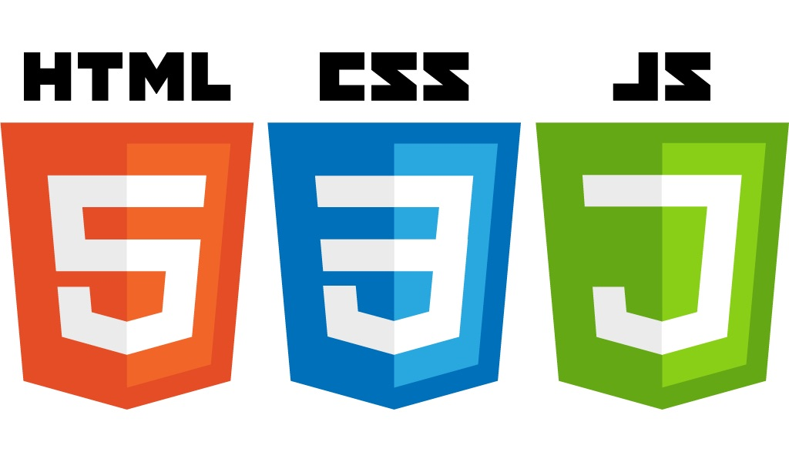

# DigitalClock Application

### Summary
For my Clock application I applied the knowlege I learned to use built in objects using the Date structure as well as concatenate month, day and year. 

#### View my Digital Clock [Click Here](https://graceec.github.io/DigitalClock/)

## Technique
A Digital Application using HTML, CSS and JavaScript
